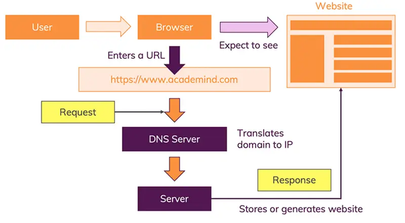

## Basic of internet. How it functions. Basic of web and how it works. 

## Basics of Internet
- Internet is a vast network of interconnected computers and servers worldwide , enabling digital communication and data exchange across continents and oceans.
- It serves as a backbone for the world wide web, allowing users to access websites and services globally.
## Components of the Internet: 
- The core components of the Internet include packets (small units of data) and protocols (rules governing data transmission). Key protocols include Ethernet, IP (Internet Protocol), HTTP (Hypertext Transfer Protocol), TCP (Transmission Control Protocol), and UDP (User Datagram Protocol).
## Infrastructure of the Internet: 
- The physical infrastructure of the Internet comprises switches and routers, which facilitate the routing of data packets across the globe. These devices direct traffic based on IP addresses, ensuring data reaches its intended destination efficiently.

## web 
- web is a service built on top of the internet's infrastructure. world wide web also referred to as web, is a critical component of the internet to access and share information through interconnected documents and other web resources.

## how does the web works
- The url gets resolved 
- A request is sent to the server of the website
- The response of the server is parsed
- The page is rendered and displayed. 

  
 [source of the image](https://academind.com/tutorials/how-the-web-works)

### The url gets resolved
- you enter the url.
- url(uniform resource locator) gets requested into DNS server(function of DNS server: to transfer the url into ip address) because all websites are identified as an IP address.
- DNS server gives the IP address to the browser
### A request is sent to the server of the website
- After the URL is resolved into an IP address by the DNS server, the browser sends an HTTP request to the server hosting the website. This request includes the IP address of the server and the original URL entered by the user. 
- The server recognizes the request based on the IP address and the port number associated with the website. It then processes the request to determine which files and data are needed to fulfill the user's request.

### The response of the server is parsed
- Once the server has prepared the necessary files and data, it sends them back to the user's browser. This data typically includes HTML, CSS, JavaScript files, and any other assets required to render the website correctly. 
- Upon receiving the data, the browser begins parsing it. Parsing involves interpreting the HTML, CSS, and JavaScript files to understand the structure, style, and interactivity of the website. 
- The HTML file is parsed first, creating a Document Object Model (DOM) that represents the structure of the website. The CSS is applied next, defining the visual appearance and layout of the elements on the page. Finally, JavaScript is executed, adding interactivity and dynamic features to the website.

### The page is rendered and displayed. 
- As the browser parses the received data, it constructs the webpage according to the instructions in the HTML, CSS, and JavaScript files. This process involves creating the webpage's structure, applying styles, and executing scripts to enable interactivity. 
- Once the webpage is fully constructed, the browser renders it for display. This means that the webpage's content, styled according to the CSS rules, is presented to the user, along with any interactive elements enabled by JavaScript. 
- Behind the scenes, the browser continues to communicate with the server as needed, handling user interactions such as form submissions, which may trigger additional requests to the server, restarting the process if necessary.